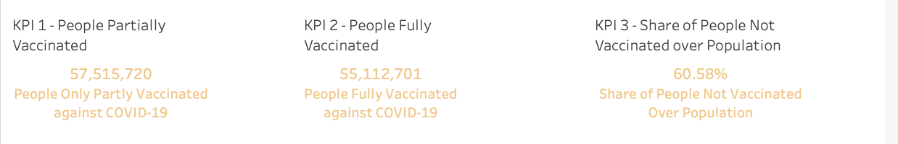
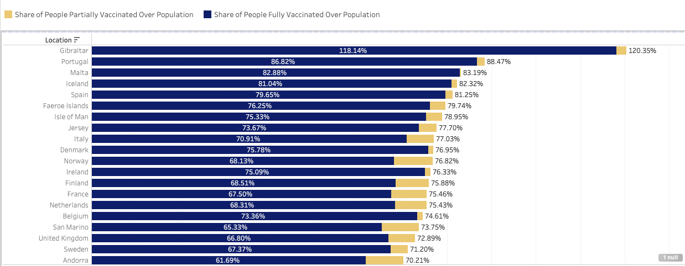
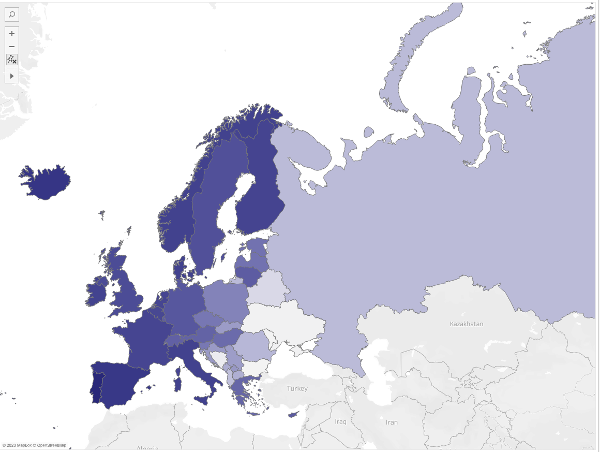
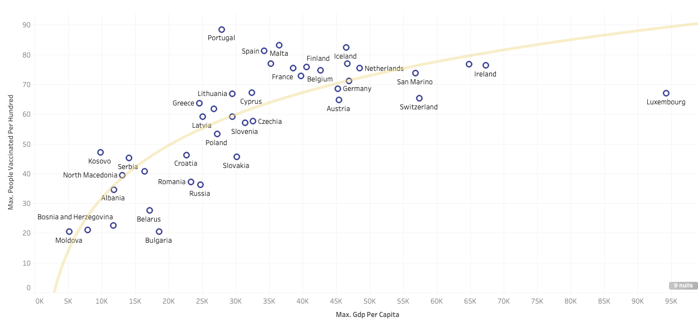

# COVID-19 Global Vaccine Tracker
The COVID-19 Global Vaccine Tracker is a dashboard created by Eduardo Andresl on GitHub to track the global vaccination progress against COVID-19. The dashboard provides an easy-to-use interface to track the number of people who have received at least one dose of the vaccine, the number of people who are fully vaccinated, and the percentage of the population that has been vaccinated. The public dashboard is available [here.](https://public.tableau.com/app/profile/karishma.damania/viz/Covid-19GlobalVaccineTracker_16768418385100/COVID-19GlobalVaccineTrackerFinal?publish=yes)

## Usage
To use the dashboard, click on the ["COVID-19 Global Vaccine Tracker"](https://public.tableau.com/app/profile/karishma.damania/viz/Covid-19GlobalVaccineTracker_16768418385100/COVID-19GlobalVaccineTrackerFinal?publish=yes) link. This will take you to the dashboard where you can view the global vaccination progress.

## Features
When you first open the dashboard, you are presented with a world map that highlights the vaccination progress of each country. The darker the shade of blue, the higher the percentage of the population that has been vaccinated. You can hover over each country to see more detailed information about their vaccination progress.

## The following KPI'S Were Used For The Analysis
KPI 1 People Partially Vaccinated.
KPI 2 People Fully Vaccinated.
KPI 3 Share of People Not Vaccinated.

## 1. Partially Vaccinated Vaccinated V/S Fully vaccinated 

This bar chart provides a visual representation of the vaccination status of the population, distinguishing between those who have received only one dose and those who have been fully vaccinated. Overall, the chart suggests that a majority of countries have vaccinated a significant portion of their population with at least one dose.

## 2. Vaccination Doses Per Hundred Of Population Map

This map provides a clear visual representation of the global vaccination progress, with lighter blue shades indicating a lower percentage of people vaccinated per 100 individuals, while darker blue shades indicate a higher percentage. In the next graph, we will explore how this map correlates with the per capita income of each country.

## 3. Variation Of Vaccine Doses Provided with GDP Per Capita 

Here, we see a correlation between vaccination progress and gross domestic product (GDP), which measures the value of goods and services produced in a country during a specified time period. Specifically, the graph shows that countries with higher per capita incomes tend to have higher levels of partial or full vaccination.

## Conclusion

In conclusion, the data analyzed provides us with valuable insights into the relationship between economic disparity and the rate of vaccination across different countries. This information is important for both governmental and economic organizations to work towards reducing the gap between developed and underdeveloped countries. To explore the complete analysis, please refer to my official website on Tableau Public.
